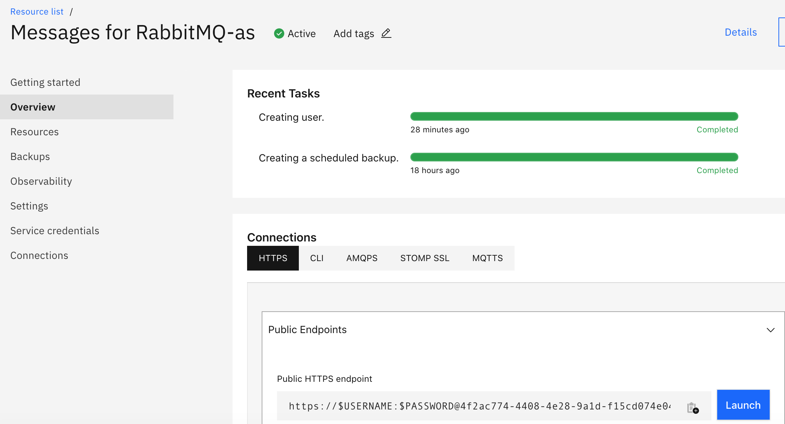
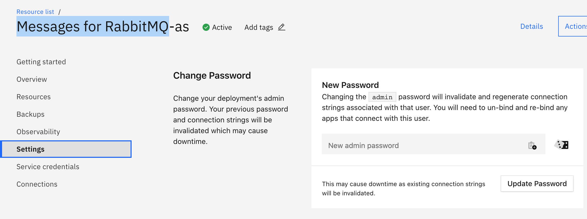
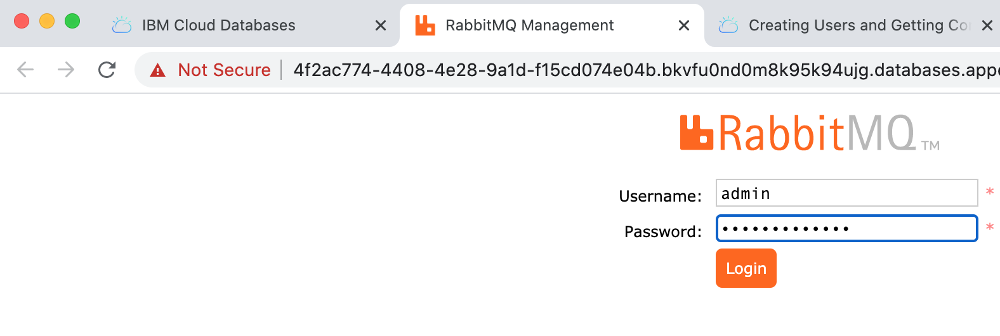

# messages-rabbitmq
Java Client for Messages for rabbit mq in IBM Cloud

Login to IBM Cloud. Under Catalog, search for "Messages for RabbitMQ". Create a service instance "Messages for RabbitMQ-as". 

Here is my Summary of my created Service instance:  

Region: Dallas  
Plan: Standard  
Service name: Messages for RabbitMQ-rb  
Resource group: Default  
  
Service instance will be provisioned in few minutes. From the dashboard, navigate to Services - Messages for RabbitMQ-as. 

Find the RabbitMQ Admin Console:
The URL to launch RabbitMQ Admin console is found under Overview - Connections - HTTPS.

 

To Login to Admin console, you need a username and password. Set the password (minimum 10 characters) for admin user as shown in the below screen shot:

Click Launch button in the Overview - Connections - HTTPS. Login with username/password as admin/<new password set above>. 
  

Java doc for Rabbit MQ: https://rabbitmq.github.io/rabbitmq-java-client/api/current/allclasses.html

IBM Cloud Messages for Rabbitmq: https://cloud.ibm.com/services/messages-for-rabbitmq/ 

