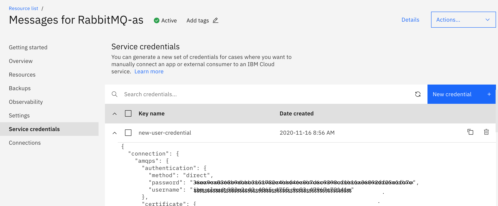
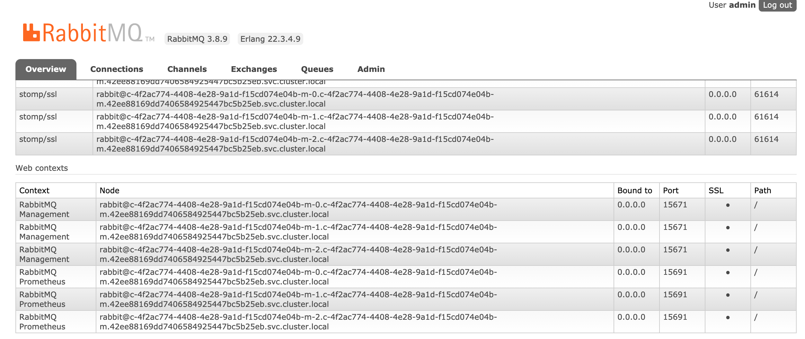
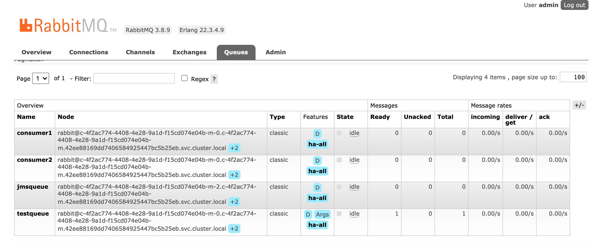

# messages-rabbitmq
JMS Client samples for Messages for rabbit mq in IBM Cloud. 

IBM Cloud Messages for Rabbitmq: https://cloud.ibm.com/services/messages-for-rabbitmq/ 

Login to IBM Cloud. Under Catalog, search for "Messages for RabbitMQ". Create a service instance "Messages for RabbitMQ-as". 

Here is my Summary of my created Service instance:  

Region: Dallas  
Plan: Standard  
Service name: Messages for RabbitMQ-rb  
Resource group: Default  
  
Service instance will be provisioned in few minutes. From the dashboard, navigate to Services - Messages for RabbitMQ-as. 

**RabbitMQ Admin Console**

The URL to launch RabbitMQ Admin console is found under Overview - Connections - HTTPS.

 

To Login to Admin console, you need a username and password. Set the password (minimum 10 characters) for admin user as shown in the below screen shot:

**Create new user in Rabbit MQ**

If you do not want to use admin user, then follow the steps for creating new user [here](https://cloud.ibm.com/docs/messages-for-rabbitmq?topic=messages-for-rabbitmq-connection-strings)  You can share this user with other applications. 

Click Launch button in the Connections - HTTPS screen. In the Admin Console Launch screen, login with username/password as admin/<new password set above>. 
  

Now, let us find all RabbitMQ configuration. In the screen shot below, you can see that the SSL Protocol is enabled.  

So, we need to enable SSL protocol in connection factory. 

In the Admin console, you can also find all created queues as shown below: 

You find the Java doc for Rabbit MQ [here](https://rabbitmq.github.io/rabbitmq-java-client/api/current/allclasses.html)  

Download all prerequisite jars for Rabbit MQ [here](https://jar-download.com/artifact-search/rabbitmq-jms). The files are downloaded under **/Users/malark/downloads**.    

I followed the examples from this website to code for [JMS Client](https://examples.javacodegeeks.com/enterprise-java/jms/jms-client-example/)

Open a terminal and set the CLASSPATH as below:

> (base) Malars-MacBook-Pro-2:rabbit-test malark$ export CLASSPATH=/Users/malark/downloads/slf4j-api-1.7.30.jar:/Users/malark/downloads/geronimo-jms_1.1_spec-1.1.1.jar://Users/malark/downloads/rabbitmq-jms-2.2.0.jar:/Users/malark/downloads/amqp-client-5.10.0.jar

### JMS Client for Point to Point messaging style

The code **JMSProducer.java** creates a connection factory, create a new connection and session, create message producers which we will then use to send messages. It creates a queue called **jmsqueue**. It send the message to the created queue.  

We will first obtain a connection factory, which we will then use to create a connection.

In the Connection factory, set the username and password from the New Service Credentials. Set the Virtual host as "/". Enable the SSL Protocol. Set the hostname and port from Message for RabbitMQ service - Connections - AMQPS screen as shown below.

	

Compile and Run the Program as shown below:

> Malars-MacBook-Pro-2:rabbit-test malark$ **javac JMSProducer.java**

> Malars-MacBook-Pro-2:rabbit-test malark$ ** java JMSProducer.java**  
SLF4J: Failed to load class "org.slf4j.impl.StaticLoggerBinder".  
SLF4J: Defaulting to no-operation (NOP) logger implementation  
SLF4J: See http://www.slf4j.org/codes.html#StaticLoggerBinder for further details.  
Created Connection Factory  
Created Connection  
Sending text 'Task0'  
Sending text 'Task1'  
Sending text 'Task2'  
Sending text 'Task3'  
Sending text 'Task4'  
Sending text 'Task5'    
Sending text 'Task6'  
Sending text 'Task7'  
Sending text 'Task8'  
Sending text 'Task9'  

The code **JMSAsyncReceiveQueueClient.java** creates a connection factory, create a new connection and session, create message consumers which we will then use to receive messages from the created queue **jmsqueue**. 

Compile and Run the Program as shown below:

> Malars-MacBook-Pro-2:rabbit-test malark$ **javac JMSAsyncReceiveQueueClient.java**  

> (base) Malars-MacBook-Pro-2:rabbit-test malark$ **java JMSAsyncReceiveQueueClient.java**  
SLF4J: Failed to load class "org.slf4j.impl.StaticLoggerBinder".  
SLF4J: Defaulting to no-operation (NOP) logger implementation   
SLF4J: See http://www.slf4j.org/codes.html#StaticLoggerBinder for further details.  
Created Connection Factory  
Created Connection  
Customer received Task0  
Customer received Task1  
Customer received Task2  
Customer received Task3  
Customer received Task4    
Customer received Task5  
Customer received Task6  
Customer received Task7  
Customer received Task8  
Customer received Task9    
Customer received END  

### JMS Client for Publish/Subscribe messaging style

