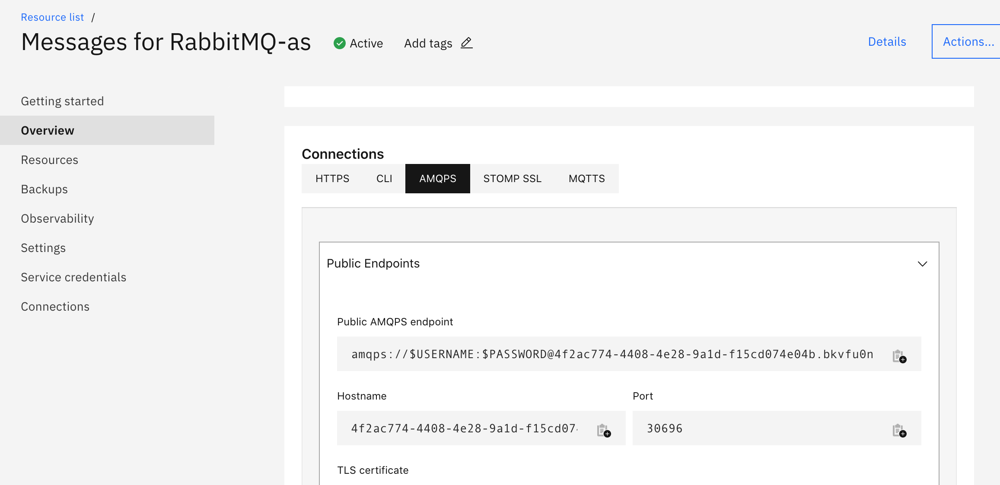

### Steps to verify the TLS certificate of IBM Cloud Rabbit MQ 

Following are the steps to verify the TLS certificate of IBM Cloud Rabbit MQ:  

1. Follow the steps mentioned [here](https://cloud.ibm.com/docs/messages-for-rabbitmq?topic=messages-for-rabbitmq-management-plugin) under the topic **Using the self-signed certificate**. This is for downloading the TLS Certificate of the user.   

a) You can find the TLS Certificate of admin user, under Messages for RabbitMQ-as - Overview - Connections - AMQPS. Copy the TLS Certificate from Content textbox.  

. 

b) Copy the value of Contents textbox. Here is a sample TLS Certificate.


```
-----BEGIN CERTIFICATE-----
XYZCCAABBDD.....

UA==
-----END CERTIFICATE-----
```
   
c) Create a new file **client_cert.pem** and copy the above Contents string into the file. 

2. Download the code from internal github repo: https://github.ibm.com/ibm-cloud-databases/rabbitmq-client-examples 

```
git clone git@github.ibm.com:ibm-cloud-databases/rabbitmq-client-examples.git
```
 
3. Follow the steps mentioned [here](https://github.ibm.com/ibm-cloud-databases/rabbitmq-client-examples/tree/master/java/rabbitmq-client/TestConnectionCertificateOnly) for verifying the TLS Certificate programmatically using java.     

> (base) Malars-MacBook-Pro-2:content malark$ cd rabbitmq-client-examples/java/rabbitmq-client/TestConnectionCertificateOnly  

> (base) Malars-MacBook-Pro-2:TestConnectionCertificateOnly malark$ ls  

> README.md				TestConnectionCertificateOnly.java	compile.sh				download_dependencies.sh 

> (base) Malars-MacBook-Pro-2:TestConnectionCertificateOnly malark$ pwd 

> /Users/malark/content/rabbitmq-client-examples/java/rabbitmq-client/TestConnectionCertificateOnly 

> (base) Malars-MacBook-Pro-2:TestConnectionCertificateOnly malark$   

4. Download the jars mentioned in file download_dependencies.sh to your local mac system. Copy the downloaded jars to current directory: /Users/malark/content/rabbitmq-client-examples/java/rabbitmq-client/TestConnectionCertificateOnly.       

https://repo1.maven.org/maven2/com/rabbitmq/amqp-client/5.7.3/amqp-client-5.7.3.jar

https://repo1.maven.org/maven2/org/slf4j/slf4j-api/1.7.28/slf4j-api-1.7.28.jar   

https://repo1.maven.org/maven2/org/slf4j/slf4j-simple/1.7.28/slf4j-simple-1.7.28.jar   

> (base) Malars-MacBook-Pro-2:TestConnectionCertificateOnly malark$ ls   

> README.md				amqp-client-5.7.3.jar			download_dependencies.sh		slf4j-simple-1.7.28.jar 
> TestConnectionCertificateOnly.java	compile.sh				slf4j-api-1.7.28.jar 
 
> (base) Malars-MacBook-Pro-2:TestConnectionCertificateOnly malark$ javac -cp .:amqp-client-5.7.3.jar:slf4j-api-1.7.28.jar:slf4j-simple-1.7.28.jar *.java   

> (base) Malars-MacBook-Pro-2:TestConnectionCertificateOnly malark$ ls   

> README.md				TestConnectionCertificateOnly.java	compile.sh				slf4j-api-1.7.28.jar 

> TestConnectionCertificateOnly.class	amqp-client-5.7.3.jar			download_dependencies.sh		slf4j-simple-1.7.28.jar 


5. Copy the file created in step 1 **client_cert.pem** here in current directory. 

6. Run the command as shown below:    

a) create a new Java trust store to use with the Java test application:   

```
keytool -importkeystore -storepass changeit -noprompt -srckeystore $JAVA_HOME/lib/security/cacerts -srcstorepass changeit -destkeystore rabbitstore
``` 

b) import the certificate from file 'client_cert.pem' into the Java trust store:   

```
keytool -import -alias targetrmq -file client_cert.pem -keystore rabbitstore -storepass changeit -noprompt
```

c) Delete an existing alias from keystore. This is needed when you get an error that alias already exists in keystore. 

``` 
keytool -delete  -alias targetrmq -keystore rabbitstore 
Enter keystore password: changeit   
(base) Malars-MacBook-Pro-2:TestConnectionCertificateOnly malark$ keytool -import -alias targetrmq -file client_cert.pem -keystore rabbitstore -storepass changeit -noprompt 
Certificate was added to keystore 

``` 

d) run the compiled Java test application using those properties:   

> (base) Malars-MacBook-Pro-2:TestConnectionCertificateOnly malark$ export USERNAME="admin" 

> (base) Malars-MacBook-Pro-2:TestConnectionCertificateOnly malark$ export PASSWORD="xxxxxxxxxxxxxxxx"   

> (base) Malars-MacBook-Pro-2:TestConnectionCertificateOnly malark$ export HOSTNAME="4f2ac774-4408-4e28-9a1d-f15cd074e04b.bkvfu0nd0m8k95k94ujg.databases.appdomain.cloud" 

> (base) Malars-MacBook-Pro-2:TestConnectionCertificateOnly malark$ export PORT=30696

> (base) Malars-MacBook-Pro-2:TestConnectionCertificateOnly malark$ java -cp .:amqp-client-5.7.3.jar:slf4j-api-1.7.28.jar:slf4j-simple-1.7.28.jar   TestConnectionCertificateOnly $HOSTNAME $PORT $USERNAME $PASSWORD true true $PWD 

> Certificate verification via custom trust store enabled 

> Hostname verification enabled 

> Received message: Hello World!   

You should see the above messages. 
